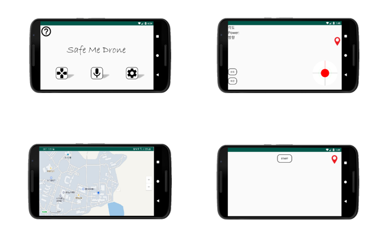
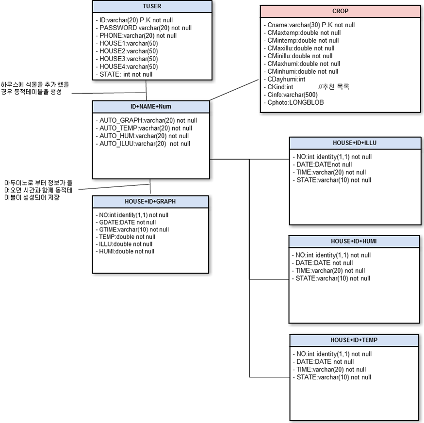

# 📱 음성인식 조종 드론

## 📌프로젝트 소개 및 시연영상

- 드론이 조종기 조작없이 소프트웨어로 정의하여 자율 주행이 가능한 어플 개발
- GPS신호를 통해 자율주행을 가능하도록 하는 소프트웨어 개발
- 비행체 안정화 기술를 사용하여 스스로 호버링이 가능한 드론 제작

​	👇 시연영상 보기

 

## 💡기획배경

- 드론의 자율 주행을 소프트웨어 기반으로 개발함으로써 드론의 활용도 향상

- 드론 조작 난이도 완화를 통한 드론에 대한 접근성 향상

- 드론 자율 주행을 이용하여 새로운 드론 촬영기법 기술향상

 

## 💻 기술 스택 및 개발환경

- Android Studio
- Java
- Naver API
- Bluetooth 소켓 통신

 

## 🧩 화면설계서

 

## ✨테이블 설계서(ERD)

